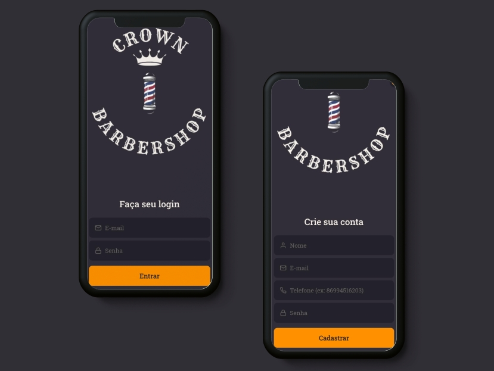
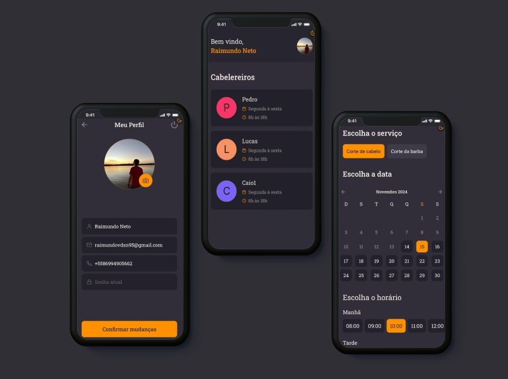

<div align="center">
  <br />
    <h3 >Barber App - Pagina de Login e Criar conta</h3>
      
      <h3 >Barber App - Pagina de agendamento e perfil</h3>
      
  <br />

  <div>
    
    
  </div>

  <h3 align="center">Barber App</h3>

   <div align="center">
     "Aplicativo de Agendamento de Barbearia" é um projeto de extensão que contou com a participação de alunos da Faculdade Estácio Teresina, cursando o 4° período de ciência da computação. Nosso objetivo era criar um aplicativo que otimizasse o processo de agendamento de barbearias, oferecendo uma solução prática para clientes e barbeiros.
    </div>
</div>

## 📋 <a name="table">Índice</a>

1. ⚙️ [Tech Stack](#tech-stack)
3. 🔋 [Features](#features)
4. 🤸 [Quick Start](#quick-start)

## 🚨 Video de demonstração

<a href="https://www.youtube.com/watch?v=9HMFDJDc6sY" target="_blank"></a>

## <a name="tech-stack">⚙️ Tech Stack</a>

- React Native
- Expo
- Appwrite

## <a name="features">🔋 Features</a>

👉 **Sistema robusto de autenticação e autorização**: o login de e-mail seguro protege as contas dos usuários.

👉 **Agendamento de horários**: Veja horários disponiveis e crie um agendamento.

👉 **Enviar SMS**: envie sms de agendamento realizado ao cliente.

👉 **Atualizar perfil**: Troque avatar, nome de usuário, email e telefone.

👉 **Upload de avatar**: Carregue o avatar da sua conta diretamente do aplicativo com seleção de mídia integrada.


e muito mais.

## <a name="quick-start">🤸 Início rápido</a>

Siga estas etapas para configurar o projeto localmente em sua máquina.

**Pré-requisitos**

Certifique-se de ter o seguinte instalado em sua máquina:

- [Git](https://git-scm.com/)
- [Node.js](https://nodejs.org/en)
- [yarn](https://classic.yarnpkg.com/lang/en/docs/install/) 

**Clonando o repositório**

```bash
git clone https://github.com/LyanKaleu/Barber-App.git
cd Barber-App
```
**Instalação**

Instale as dependências do projeto usando npm:

```bash
yarn install
```

**Executando o projeto**

```bash
yarn start
```

**Expo Go**

Baixe o aplicativo [Expo Go](https://expo.dev/go) em seu dispositivo e use-o para escanear o código QR do Terminal e execute.
